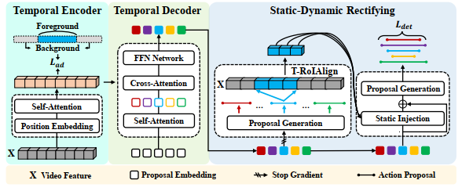

# <p align="center">Towards Completeness: A Generalizable Action Proposal Generator for Zero-Shot Temporal Action Localization</p>

### <p align="center">*Jia-Run Du, Kun-Yu Lin, Jingke Meng, and Wei-Shi Zheng*</p>

#### <p align="center">[[Paper]](https://arxiv.org/abs/2408.13777) </p>

Official repository of ICPR 2024 paper "Towards Completeness: A Generalizable Action Proposal Generator for Zero-Shot Temporal Action Localization".

<center>
    
</center>

> We propose a novel Generalizable Action Proposal generator named GAP, which can generate more complete action proposals for unseen action categories compared with previous works. Our GAP is designed with a query-based architecture, enabling it to generate action proposals in a holistic way. The GAP eliminates the need for hand-crafted post-processing, supporting seamless integration with CLIP to solve ZSTAL. Furthermore, we propose a novel Staitc-Dynamic Rectifying module, which integrates generalizable static and dynamic information to improve the completeness of action proposals for unseen categories. 


## 💬 News
- [2024.10.13] 🎊 The training/test scripts, pre-trained ckpts and video features are available.
- [2024.08.21] 🥳 Code of GAP is initial released. 
- [2024.07.06] 🎉 Our work is accepted by ICPR 2024. 


## 🔧 Requirements
- Python 3.8 and Pytorch 2.0.1 are used.
- We conduct the environments on a **single 1080Ti** GPU.
- Create the anaconda environment as what we used, as bellow:
```shell
conda create -n gap python=3.8
conda install pytorch==2.0.1 torchvision==0.15.2 torchaudio==2.0.2 pytorch-cuda=11.7 -c pytorch -c nvidia
pip install -r requirements.txt
```

## 📕 Prepare the data
- The features that extracted via CLIP for [`[Thumos14]`](https://pan.baidu.com/s/1tR25iyeKNOwMSU6RfyLFtA?pwd=8qr9) and [`[ActivityNet1.3]`](https://pan.baidu.com/s/1sLAfU4UCD-UiglC57veXaA?pwd=tkn4) dataset can be downloaded. 
- After downloading, modify the `feature_path` in `config file` to your own path.

## 👀 Quick Start
- Download the pre-trained [`[checkpoints]`](https://pan.baidu.com/s/1BM2lAzfRfemw0ZwqhGacsw?pwd=dpq8).
- Create the default folder **./ckpt** and put the downloaded pre-trained models into **./ckpt**.
- Run the test scripts:
```shell
# Thumos14
CUDA_VISIBLE_DEVICES=0 python test.py --model_name "Train_Thumos14" --cfg_path "./config/Thumos14_CLIP_zs_75_8frame.yaml" --batch_size 16 --postprocess_type "class_agnostic" --postprocess_topk 100 --num_queries 40 --enc_layers 2 --dec_layers 5 --norm_embed --exp_logit_scale --proposals_weight_type "after_softmax" --enable_classAgnostic --enable_refine --refine_drop_saResidual --salient_loss

# ActivityNet1.3
CUDA_VISIBLE_DEVICES=0 python test.py --model_name "Train_ActivityNet13" --cfg_path "./config/ActivityNet13_CLIP_zs_75.yaml" --batch_size 16 --target_type "prompt" --num_queries 30 --postprocess_type "class_agnostic" --postprocess_topk 100 --rescale_length 300 --enc_layers 2 --dec_layers 2 --enable_backbone --norm_embed --exp_logit_scale --proposals_weight_type "after_softmax" --enable_classAgnostic --enable_refine --refine_drop_saResidual --salient_loss
```

## 🏷️ Train Your Own Model
- Thumos14
```shell
CUDA_VISIBLE_DEVICES=0 python main.py --model_name "Train_Thumos14" --cfg_path "./config/Thumos14_CLIP_zs_75_8frame.yaml" --save_result --batch_size 16 --lr 1e-4 --epochs 100 --postprocess_type "class_agnostic" --postprocess_topk 100 --num_queries 40 --enc_layers 2 --dec_layers 5 --actionness_loss_coef 3 --norm_embed --exp_logit_scale --proposals_weight_type "after_softmax" --enable_classAgnostic --enable_refine --refine_drop_saResidual --salient_loss --salient_loss_coef 3
```

- ActivityNet1.3
```shell
CUDA_VISIBLE_DEVICES=0 python main.py --model_name "Train_ActivityNet13" --cfg_path "./config/ActivityNet13_CLIP_zs_75.yaml" --save_result --batch_size 16 --target_type "prompt" --lr 5e-5 --epochs 100 --num_queries 30 --postprocess_type "class_agnostic" --postprocess_topk 100 --rescale_length 300 --enc_layers 2 --dec_layers 2 --enable_backbone --lr_backbone 1e-2 --norm_embed --exp_logit_scale --proposals_weight_type "after_softmax" --enable_classAgnostic --actionness_loss_coef 3 --enable_refine --refine_drop_saResidual --salient_loss
```


## Acknowledgement
We would like to thank the contributors to the [Conditional DETR](https://github.com/Atten4Vis/ConditionalDETR) and [video_features](https://github.com/v-iashin/video_features) for their open research and exploration.


## 📝 Citation

If you find GAP useful for your research and applications, please cite using this BibTeX:

```bibtex
@article{du2024towards,
  title={Towards Completeness: A Generalizable Action Proposal Generator for Zero-Shot Temporal Action Localization},
  author={Du, Jia-Run and Lin, Kun-Yu and Meng, Jingke and Zheng, Wei-Shi},
  journal={arXiv preprint arXiv:2408.13777},
  year={2024}
}
```